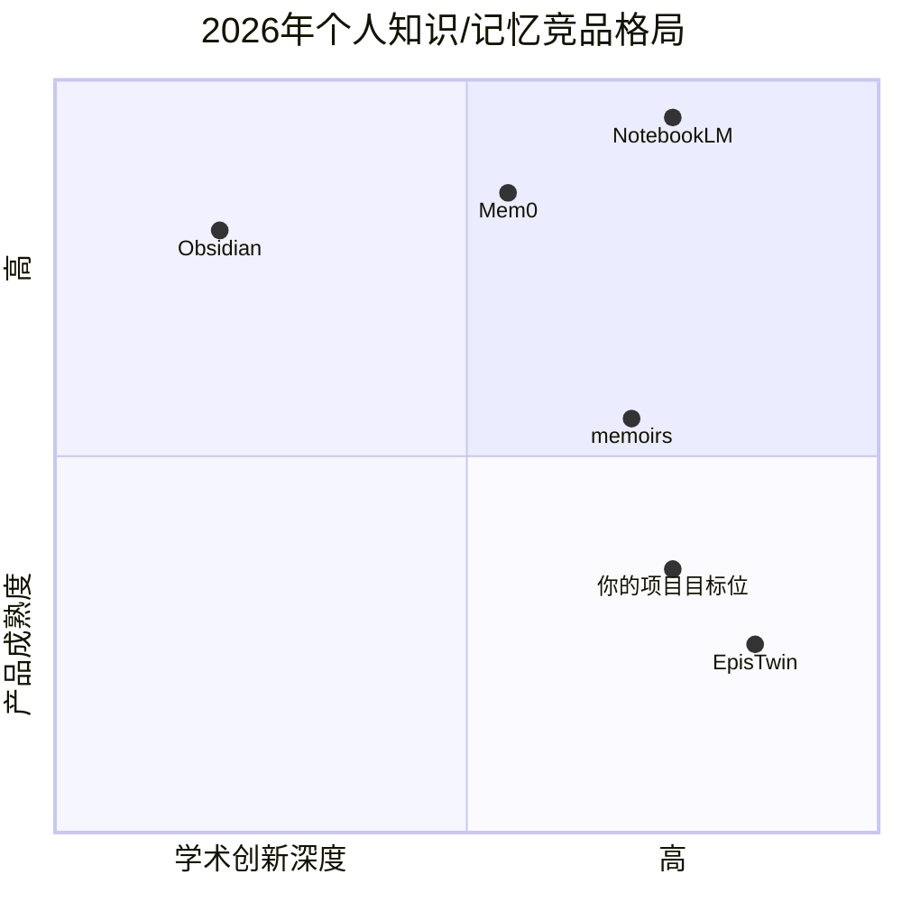
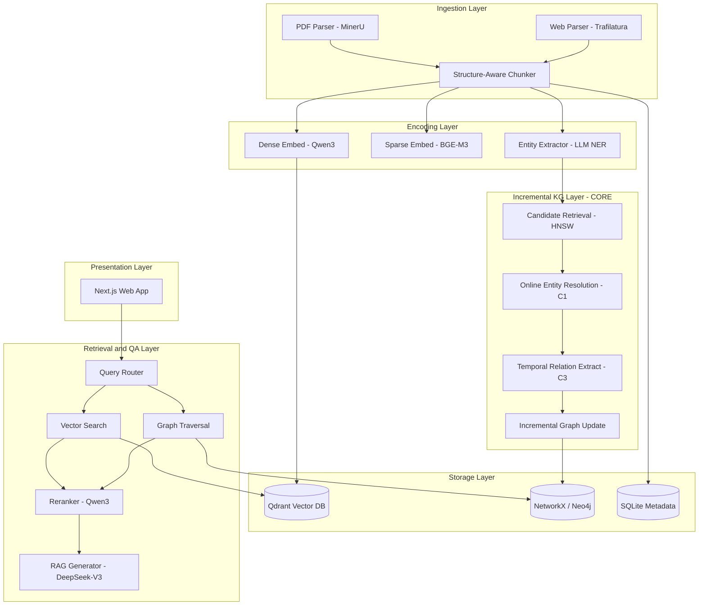

# 多模态增量知识库项目 — 可行性评估与技术方案设计

> **评估角色**：资深技术顾问 + 学术导师（第三方独立视角）  
> **评估日期**：2026 年 6 月 7 日  
> **依据文档**：[项目评估提示词.md](项目评估提示词.md)、[LLM知识库项目方向项目讨论.md](LLM知识库项目方向项目讨论.md)  
> **外部调研**：2026 年 Q1–Q2 论文、开源项目、产品动态、会议截稿日期

---

# 任务一：整体可行性评估

## 1. 方向判断：是否仍然值得做？

### 结论：**值得做，但窗口已经明显收窄——必须从"通用个人知识库"收缩为"增量跨模态实体对齐 + 时序 KG"的学术问题。**

### 学术侧（2026 年 4–6 月最新态势）

讨论记录中引用的 ATOM、GAAMA、iText2KG 等方向**已被快速跟进**，不再是空白：

| 工作 | 时间 | 与项目的重叠 | 对你的影响 |
|------|------|-------------|-----------|
| [GAAMA](https://arxiv.org/abs/2603.27910) (arXiv 2603.27910) | 2026.03 | 概念节点 + PPR 混合检索，解决 HippoRAG mega-hub 问题 | 直接竞争 C1 的图检索路由思路 |
| [TeleMem](https://arxiv.org/pdf/2601.06037) | 2026.01 | 多模态长期记忆、DAG 结构、增量写入 | 竞争"个人/agent 记忆"叙事 |
| [EpisTwin](https://arxiv.org/pdf/2603.06290) | 2026.03 | 个人 KG + 多模态抽取 + GraphRAG + 视觉精炼 | **高度重叠**：几乎就是你的产品愿景的学术版 |
| [DIAL-KG](https://arxiv.org/pdf/2603.20059) | 2026.03 | 无 schema 增量 KG、事务式更新 | 竞争 C1 增量构建 |
| [MRCKG / CMMKGR](https://arxiv.org/abs/2604.02778) | 2026.04 | 多模态 KG 的持续学习、灾难性遗忘 | 竞争 C2 跨模态对齐 |
| [memoirs](https://github.com/misaelzapata/memoirs) | 2026 活跃 | 本地优先、HippoRAG PPR、双时态 `as_of=t` | 开源竞品，工程完成度高 |

**学术窗口期判断**：
- ❌ "我做了个多模态个人知识库系统" — **已死**，EpisTwin、TeleMem、GAAMA 把故事讲完了
- ✅ "增量式跨模态实体消解 + 带时序边的局部子图更新" — **仍有空间**，但必须在某个子问题上做出**可量化超越**
- ⚠️ 纯工程系统论文（WWW Applied Track）仍可行，但 2026 年审稿人会更苛刻地要求与 Mem0/memoirs/GAAMA 的对比

### 产品侧（2026 年 4–6 月最新态势）

| 竞品 | 2026 状态 | 威胁等级 |
|------|----------|---------|
| **NotebookLM** (Google) | Mind Maps、Video Overviews、Gemini 3.5 Flash；Canvas/Connectors/Personal Preferences 内测中 | 🔴 **致命** — 免费、多模态、图谱可视化、Google 生态 |
| **Mem0** | ~50k stars，向量+图混合，186M+ 月 API 调用，$24M 融资 | 🔴 开发者生态碾压 |
| **Mem AI** | 2026 年 personal memory layer 默认选项，$20/月 | 🟠 C 端笔记场景 |
| **memoirs / Memgentic / Noosphere** | 2026 开源爆发，本地优先 + MCP + 混合检索 + 时序 | 🟠 开发者/极客用户 |
| **Notion AI / Obsidian + Copilot** | 存储+简单 AI，未做深增量 KG | 🟢 差异化有限但用户基数大 |
| **Readwise Reader** | 阅读采集强，关联弱 | 🟢 可合作而非竞争 |

**产品窗口期判断**：
- ❌ 做"又一个 Notion + Perplexity"通用 C 端 — **没有窗口**
- ⚠️ 做"学习流自动化"垂直工具 — **窄窗口**，NotebookLM 正在快速补齐
- ✅ 做**开源核心模块**（增量多模态 KG 构建库）+ 托管/API — **仍有 12–18 个月窗口**
- ✅ 做 **Zotero/Obsidian 插件**（增量关联、跨模态对齐）— 最务实的商业化路径

### 总判断

| 维度 | 2026.06 结论 |
|------|-------------|
| 学术 | 子问题级创新仍可做，系统级叙事已被 EpisTwin 等占坑 |
| 产品 | 通用 PKM 无窗口；开源模块/插件/垂直学习场景有窗口 |
| 综合 | **值得做，但必须大幅收缩范围，且论文目标会议需调整（见任务二）** |

---

## 2. 难度评估：3–4 个月同时出论文+产品，是否现实？

### 概率估计（基于 2026.06.07 今天开始）

| 目标组合 | 成功概率 | 说明 |
|---------|---------|------|
| 可演示 MVP（PDF+网页+简单图谱+问答） | **75–85%** | AI 辅助下工程不是瓶颈 |
| 可投稿论文（含消融+自建数据集） | **40–55%** | 取决于创新点聚焦和数据标注 |
| 论文被 EMNLP/ACL Findings 接收 | **15–25%** | 竞争激烈，EpisTwin 等已占位 |
| 论文被 Workshop/Demo Track 接收 | **45–60%** | 更现实的第一枪 |
| 同时出 MVP + 可投稿论文 | **35–45%** | 比 Kimi 估计的 3 个月略保守，但 AI 辅助确实压缩工程 |
| 同时出完整产品（含视频/播客）+ 顶会主会论文 | **<10%** | 不建议 |

### 关键修正：AI 辅助改变了什么、没改变什么

**AI 确实压缩了（约 60–70% 工程时间）**：
- 前端 React + D3/Cytoscape 图谱
- FastAPI 后端脚手架
- Milvus/Neo4j SDK 对接
- Docker 部署、测试代码

**AI 无法压缩（仍是 2–3 个月硬成本）**：
- 研究问题定义与 Related Work 定位（EpisTwin 刚出来，你必须说清楚差异）
- 自建评测集标注（50–100 文档，跨模态实体对齐 + 时序关系）
- 消融实验的 insight 提炼
- 增量实体消解的边界 case 调优（"Transformer" vs "注意力机制"）

**你同事 4 个月发 AAAI 的映射**：
- 他做的可能是**单一明确算法点 + 公开 benchmark**，而非"系统+论文"双线
- 你的项目如果也**只聚焦 C1 或 C3 其中一个**，3–4 个月出论文是**可行的**
- 如果坚持"完整多模态产品 + 三创新点 + 顶会主会"，概率很低

### 最诚实的结论

> **3–4 个月可以出「能演示的 MVP + 可投稿的 Workshop/Findings 级论文」，但不能出「完整多模态产品 + ACL 主会论文」。**

---

## 3. 风险预警：最大的 3 个风险

### 风险 1：会议截稿已错过 — 时间线错位（🔴 致命）

**这是讨论记录中最大的盲区。** 截至 2026.06.07：

| 会议 | 截稿状态 | 说明 |
|------|---------|------|
| ACL 2026 | ❌ 已截止（2026.01.05 ARR） | 会议 7 月 2–7 日 |
| AAAI 2026 | ❌ 已截止（2025.08.01） | 会议已开完 |
| ACM MM 2026 | ❌ 已截止（2026.04.01） | — |
| EMNLP 2026 | ❌ 新投稿已截止（ARR May 2026.05.25） | 仅已提交 ARR May 的论文可 commit（2026.08.02） |
| **ARR August 2026** | ✅ **2026.08.03 开放** | → EACL 2027（commit 2026.10.11） |
| **ARR October 2026** | ✅ 2026.10.12 开放 | → ACL 2027 / NAACL 2027 |

**影响**：如果你今天（6 月 7 日）才开始，**不可能赶上 EMNLP 2026**。最早 realistic 目标是 **EACL 2027（2026.08 ARR 投稿）** 或 **ACL 2027（2026.10 ARR 投稿）**。

**应对**：立即调整预期，以 8 月 3 日 ARR 为 hard deadline 倒排 8 周计划。

### 风险 2：EpisTwin + NotebookLM 双面夹击 — 差异化不足（🟠 高）

- **EpisTwin**（2026.03）已经做了：多模态 → 个人 KG → GraphRAG → 视觉精炼 → 合成 benchmark PersonalQA
- **NotebookLM** 免费提供了：多源导入、Mind Maps、Video Overviews、即将上线的 Connectors

如果你的论文 story 是"我做了个个人多模态知识库"，审稿人会问：**与 EpisTwin 的区别是什么？**

**应对**：论文必须聚焦一个 EpisTwin **没做透** 的点：
- 增量在线实体消解（EpisTwin 未强调流式更新）
- 跨模态时序边（improves/contradicts/extends）
- 增量更新的效率对比（局部更新 vs 全量重建）

### 风险 3：评测数据集自建 — 论文最大瓶颈（🟠 高）

这个方向**没有标准 benchmark**。讨论记录建议的"50 篇论文 + 20 视频 + 10 播客"：
- 跨模态实体对齐标注：至少 2–3 周（即使 AI 预标注）
- 时序关系标注：法律/学术场景才有清晰 ground truth
- 审稿人会质疑数据集规模和标注质量

**应对**：
- Week 1 就开始边用边标，不要最后集中标注
- 考虑复用/扩展 LoCoMo、LongMemEval 的时序问答子集作为辅助评测
- 论文中诚实报告数据集规模（小数据集 + 详细 case study 也可发 Findings）

---

## 4. 竞品再确认（2026 年 4–6 月）

### 必知竞品（讨论记录未覆盖或低估）

| 竞品 | 类型 | 核心能力 | 你的差异化空间 |
|------|------|---------|--------------|
| [NotebookLM](https://notebooklm.google.com) | 商业/免费 | 多模态源、Mind Maps、Video Overviews、Canvas(内测) | 开源、本地部署、增量 KG 算法、跨源时序 |
| [EpisTwin](https://arxiv.org/pdf/2603.06290) | 学术论文 | 个人 KG + 多模态 + GraphRAG | 增量更新、时序边、效率 |
| [GAAMA](https://arxiv.org/abs/2603.27910) | 学术论文/开源 | 概念节点 + PPR 混合检索 | 多模态（GAAMA 仅对话） |
| [Mem0](https://github.com/mem0ai/mem0) | 开源+SaaS | 向量+图混合记忆，50k stars | 文档级（非对话）多模态 |
| [memoirs](https://github.com/misaelzapata/memoirs) | 开源 | 本地、HippoRAG PPR、双时态、MCP | 多模态文档（memoirs 偏对话导入） |
| [Memgentic](https://github.com/Chariton-kyp/Memgentic) | 开源 | AI 工具跨平台记忆、Skills 分发 | 文档/学习内容管理 |
| [Noosphere](https://github.com/SweetSophia/noosphere) | 开源 | Agent 记忆层、Markdown wiki、冲突检测 | 多模态 ingestion |
| [TeleMem](https://arxiv.org/pdf/2601.06037) | 学术论文 | 多模态 agent 长期记忆 DAG | 个人学习场景 |
| [Zep/Graphiti](https://github.com/getzep/graphiti) | 开源+企业 | 时序知识图谱、bi-temporal | 企业场景，个人学习未覆盖 |
| [Mem AI](https://mem.ai) | 商业 | 笔记优先 personal memory graph | 不做增量 KG 算法 |

### 竞品格局总结



**你的生存空间**：学术创新深度高 + 产品成熟度中等偏下的「增量跨模态 KG 算法 + 开源工具」象限。

---

# 任务二：方案优化建议

## 1. 范围裁剪：Minimum Viable Scope（3–4 个月）

### 必须砍掉

| 砍掉项 | 原因 |
|--------|------|
| ❌ 视频/播客多模态（Phase 2–4） | 工程量大、对齐难、NotebookLM 已覆盖；留作 Future Work |
| ❌ 浏览器插件（MVP 阶段） | 非论文必需；手动上传/API 导入即可 |
| ❌ C2 跨模态对比学习（需训练） | 3 个月做不完；用现成 embedding 对齐替代 |
| ❌ 三个创新点同时做 | 分散精力，论文无清晰 contribution |
| ❌ 完整 SaaS 商业化 | 先开源核心 + Demo |

### 必须保留

| 保留项 | 原因 |
|--------|------|
| ✅ PDF + 网页 ingestion | 论文/产品最小闭环 |
| ✅ **C1：在线增量实体消解** | 最强学术差异点，EpisTwin 未强调 |
| ✅ **C3：时序关系抽取**（简化版） | 与 GAAMA/memoirs 差异化，评测可做 |
| ✅ 向量 + 图混合检索 | 基线必需 |
| ✅ 简单 Web UI（上传 + 图谱 + 对话） | Demo 必需 |
| ✅ 自建小评测集（30 PDF + 20 网页） | 论文必需 |

### Minimum Viable Scope 定义

```
输入：PDF 论文 + 网页文章（手动上传或 URL）
处理：MinerU/Docling 解析 → Chunk → Embedding → 增量实体抽取 → 在线消解 → 时序边
存储：Qdrant（向量）+ Neo4j（图，可选 NetworkX 起步）
检索：向量召回 + 图遍历（简单路由：含"关系/对比/演变"关键词 → 走图）
输出：Web UI 三栏（库 / 图谱 / 对话），回答带引用溯源
论文：聚焦 C1 + 简化 C3，2 个 baseline + 3 组消融
```

---

## 2. 创新点聚焦：选 C1，辅助 C3

### 推荐：**主创新 C1（Online Entity Resolution for Incremental KG），辅创新 C3（Temporal Relation Extraction）**

| 创新点 | 推荐度 | 理由 |
|--------|--------|------|
| **C1 在线实体消解** | ⭐⭐⭐⭐⭐ **首选** | ATOM/DIAL-KG 做了增量构建但消解仍是批处理；EpisTwin 未强调流式；可量化（F1、更新时间） |
| C3 时序关系抽取 | ⭐⭐⭐⭐ 辅助 | GAAMA 有时序记忆但非文档级"improves/contradicts"；memoirs 有 bi-temporal 但无关系类型；与 C1 协同 |
| C2 跨模态对比学习 | ⭐⭐ 不推荐 | MRCKG 已做；需训练数据；MVP 阶段用 Qwen3-Embedding 零样本即可 |

### 论文 Contribution 建议（可直接用）

1. **Streaming Entity Resolution**：提出流式实体消解算法，新文档到达时仅与 Top-k 候选做模态感知匹配，复杂度 O(log N) vs 全量 O(N)
2. **Temporal Edge Induction**：用 LLM + 结构化 Prompt 从学术文档中抽取 `{improves, contradicts, extends, surveys}` 时序边
3. **IncrementalGraph-Bench**：发布小规模评测集（30 PDF + 20 网页，含实体对齐和时序关系标注）

### 更好的替代创新方向（如果 C1 实验效果不佳）

- **Conflict-Aware Retrieval**：当 KG 中存在 contradicts 边时，检索结果自动标注冲突并呈现多方观点（NotebookLM 未做）
- **Efficiency-Quality Tradeoff**：系统性地 benchmark 增量更新 vs 全量重建在不同数据规模下的质量/时间 tradeoff（偏系统论文，WWW Applied Track）

---

## 3. 技术栈修正（2026 年 6 月版）

| 模块 | 讨论记录推荐 | **2026.06 修正推荐** | 变更理由 |
|------|------------|---------------------|---------|
| PDF 解析 | Marker | **MinerU 2.x**（主）+ Docling（备选） | MinerU 2.0 OmniDocBench 86 分；CJK/公式/表格更强 |
| 网页解析 | Jina/Firecrawl | **Crawl4AI** 或 **Trafilatura** | 轻量、开源、RAG 社区 2026 默认 |
| Embedding | BGE-M3 | **Qwen3-Embedding-0.6B**（主） | MMTEB 比 BGE-M3 高 7.9%；同参数量；中文友好 |
| 稀疏检索 | 无 | **BGE-M3 或 Qwen3 的 sparse 能力** | 混合检索 baseline 必需 |
| Reranker | 无 | **Qwen3-Reranker-0.6B** | 检索精度提升 10–15% |
| 向量库 | Milvus | **Qdrant**（MVP）→ Milvus（规模化） | Qdrant 单机部署更简单；AI 生成代码友好 |
| 图数据库 | Neo4j | **Neo4j Community** 或 **NetworkX + SQLite**（MVP） | MVP 阶段 NetworkX 够用；论文实验不需要生产级图库 |
| LLM | Qwen2.5 / DeepSeek-V3 | **DeepSeek-V3** 或 **Qwen3-32B**（API） | 2026 年性价比最优 |
| 框架 | LangChain | **LlamaIndex 0.12+**（RAG 专用）或 **自研轻量 pipeline** | LangChain 抽象过重，AI 生成代码易出架构债务 |
| 推理部署 | vLLM | **vLLM 0.8+**（仅自部署 LLM 时需要） | MVP 阶段直接用 API，不需要 vLLM |
| 前端 | React + D3 | **Next.js 15 + Cytoscape.js** | Cytoscape 图谱交互比 D3 开箱即用 |
| 视频（Future Work） | Whisper + CLIP | **Whisper-large-v3-turbo + Qwen3-VL** | 2026 年 VLM 统一处理更优 |

### 技术栈清单（MVP 最终版）

```
Backend:  Python 3.12 + FastAPI 0.115 + LlamaIndex 0.12
Parsing:  MinerU 2.x + Trafilatura 2.0
Embed:    Qwen3-Embedding-0.6B (dense) + BGE-M3 (sparse, optional)
Rerank:   Qwen3-Reranker-0.6B
Vector:   Qdrant 1.14
Graph:    NetworkX 3.4 (MVP) → Neo4j 5.x (产品化)
LLM:      DeepSeek-V3 API / Qwen3-32B API
Frontend: Next.js 15 + Cytoscape.js 3.30 + Tailwind CSS 4
Deploy:   Docker Compose (dev) + 单 VPS (demo)
```

---

## 4. 学术策略

### 现实目标（从 2026.06.07 倒排）

| 优先级 | 目标 | 截稿 | 策略 |
|--------|------|------|------|
| 🥇 **第一选择** | **EACL 2027**（via ARR August 2026） | **2026.08.03** | 8 周冲刺；系统+算法完整论文 |
| 🥈 第二选择 | **ACL 2027**（via ARR October 2026） | 2026.10.12 | 如果 8 月版本实验不充分，再 polish 2 个月 |
| 🥉 保底 | **arXiv + Workshop** | 随时 | ACL/EMNLP 2026 的 System Demo / Knowledge Graph Workshop |
| ❌ 不推荐 | ACL/EMNLP 2026 主会 | 已截止 | — |
| ❌ 不推荐 | AAAI 2027 | ~2026.08 | 周期太长且偏 AI 通用 |

### 主会 vs Findings

| 选项 | 建议 | 理由 |
|------|------|------|
| 主会 | 仅当 C1 消融实验显著优于 ATOM + GAAMA + EpisTwin | 2026 年 bar 极高 |
| **Findings** | **最推荐** | 接受完整系统 + 单点创新；EpisTwin 级别工作投 Findings 合理 |
| Workshop | 保底 + 快速反馈 | 2 页 Demo Paper，用于建立 priority |

### 论文标题方向

- *"StreamResolve: Online Entity Resolution for Incremental Document Knowledge Graphs"*
- *"TemporalEdge: Incremental Knowledge Graph Construction with Temporal Relation Induction from Academic Documents"*

---

## 5. 产品差异化与商业化

### 如果产品层做不透（大概率），推荐路径

| 路径 | 做什么 | 怎么做 | 收入预期 |
|------|--------|--------|---------|
| 🥇 **开源核心库** | 发布 `stream-kg` Python 包：增量 KG 构建 + 在线消解 | GitHub 开源 → 技术博客 → Hacker News | Star 引流 → 咨询/托管 |
| 🥈 **Obsidian/Zotero 插件** | "自动关联你读过的论文" | 调用开源库 API；一次性 $15–30 | 小但稳定 |
| 🥉 **API 服务** | 增量 KG 构建 API | FastAPI 封装；按文档数计费 | 面向教育科技/研究工具创业公司 |
| 第四 | 托管 SaaS | 云端版 Demo | $10–15/月；但 NotebookLM 免费压制 |

### 一句话商业策略

> **不要跟 NotebookLM 打产品战。开源算法库建立技术声誉，插件/API 变现，论文背书。**

---

# 任务三：可执行技术文档

## A. 系统架构文档

### A.1 模块拆分



### A.2 数据流（文字描述）

1. **Ingestion**：用户上传 PDF/URL → MinerU/Trafilatura 解析 → 结构化 Chunk（含 page_num, section_title, doc_id）
2. **Encoding**：每个 Chunk → Qwen3-Embedding 向量 + LLM 抽取实体列表 `[{name, type, span}]`
3. **Online Resolution (C1)**：对每个新实体 `e_new`：
   - HNSW 从已有实体中召回 Top-20 候选
   - 计算 `score = α·cos_sim + β·lexical_overlap + γ·type_match`
   - `score > τ_merge` → 合并到已有实体；否则创建新实体
4. **Temporal Extraction (C3)**：对合并后的实体对，LLM 判断是否有时序关系 → 写入 `{head, rel, tail, timestamp, evidence_span}`
5. **Graph Update**：仅更新受影响子图（新实体 + 其 2-hop 邻居），不触发全量重建
6. **Retrieval**：用户 Query → Router 判断：
   - 简单 factual → 向量检索
   - 含"对比/演变/关系" → 向量 + 图遍历
   - → Rerank → LLM 生成 + 引用溯源

### A.3 关键接口定义

```python
# === Ingestion ===
async def ingest_document(
    source: Union[Path, str],  # file path or URL
    doc_type: Literal["pdf", "web"],
    user_id: str,
) -> IngestResult:
    """Parse, chunk, and trigger incremental KG update."""
    ...

@dataclass
class IngestResult:
    doc_id: str
    chunks: list[Chunk]
    entities_extracted: int
    entities_merged: int
    entities_created: int
    temporal_edges_added: int
    processing_time_ms: int

# === Core Algorithm (C1) ===
def online_entity_resolve(
    new_entity: Entity,
    candidate_entities: list[Entity],
    alpha: float = 0.6,   # vector similarity weight
    beta: float = 0.25,   # lexical overlap weight
    gamma: float = 0.15,  # type match weight
    threshold: float = 0.82,
) -> ResolveResult:
    """Decide merge or create for a new entity."""
    ...

@dataclass
class ResolveResult:
    action: Literal["merge", "create"]
    target_entity_id: Optional[str]
    confidence: float
    score_breakdown: dict[str, float]

# === Core Algorithm (C3) ===
async def extract_temporal_relations(
    entity_pairs: list[tuple[Entity, Entity]],
    context_chunks: list[Chunk],
    relation_types: list[str] = ["improves", "contradicts", "extends", "surveys"],
) -> list[TemporalEdge]:
    """Extract temporal relations between entity pairs using LLM."""
    ...

# === Graph Update ===
def incremental_graph_update(
    graph: KnowledgeGraph,
    new_entities: list[Entity],
    resolve_results: list[ResolveResult],
    temporal_edges: list[TemporalEdge],
) -> GraphUpdateStats:
    """Update only affected subgraph. Returns stats for paper evaluation."""
    ...

# === Retrieval ===
async def hybrid_retrieve(
    query: str,
    user_id: str,
    top_k: int = 10,
    use_graph: bool = None,  # None = auto-route
    time_filter: Optional[datetime] = None,
) -> list[RetrievalResult]:
    """Hybrid vector + graph retrieval with optional temporal filter."""
    ...
```

### A.4 部署拓扑

**开发环境**：
```
Docker Compose:
  - app (FastAPI, port 8000)
  - qdrant (port 6333)
  - neo4j (port 7474, 7687) [optional for MVP]
  - frontend (Next.js, port 3000)
  
External API:
  - DeepSeek-V3 / Qwen3 API (LLM + Embedding)
```

**Demo 部署（单 VPS, 4C8G）**：
```
VPS (Ubuntu 24.04):
  - Docker Compose (同上)
  - Nginx 反向代理 + HTTPS (Let's Encrypt)
  - 预估成本：$20-40/月 (VPS) + $30-50/月 (API)
```

---

## B. 论文实验设计文档

### B.1 数据集构建

| 项目 | 规格 |
|------|------|
| **名称** | IncrementalGraph-Bench (IGB-v1) |
| **规模** | 30 PDF（NLP/AI 论文, 2023–2026）+ 20 网页（技术博客） |
| **来源** | arXiv NLP 论文 + HuggingFace Blog + 个人收藏 |
| **增量模拟** | 按时间顺序分 5 个 batch（每 batch 6 PDF + 4 网页），模拟流式到达 |
| **标注内容** | ① 跨文档实体对齐（同一概念是否合并）② 时序关系（improves/contradicts/extends）③ 20 个 QA 对（含时序/对比/事实型） |
| **标注方式** | AI 预标注（LLM）→ 人工审核修正；预计 40–60 小时 |
| **获取** | 自建；论文发布时开源标注数据 |

### B.2 Baseline 选择

| Baseline | 类型 | 实现 |
|----------|------|------|
| **Dense RAG** | 向量检索 | Qwen3-Embedding + Qdrant + DeepSeek-V3 |
| **Hybrid RAG** | 向量+BM25 | Qwen3 dense + BGE-M3 sparse + RRF |
| **Static KG** | 全量构建 | LlamaIndex KnowledgeGraphIndex（非增量） |
| **iText2KG-style** | 增量文本 KG | 复现 ATOM/iText2KG 的增量构建（无在线消解） |
| **GAAMA-style** | 概念+PPR | 复用 GAAMA 的 concept node + PPR 检索 |
| **HippoRAG** | 实体+PPR | 开源 HippoRAG 实现 |

### B.3 评测指标

| 任务 | 指标 | 目标值（合理范围） |
|------|------|-------------------|
| 实体消解 | Entity Resolution F1 | **0.72–0.82**（30 doc 规模） |
| 实体消解 | Merge Precision@5 | **0.80–0.90** |
| 检索 | Recall@10 | **0.65–0.78** |
| 检索 | MRR | **0.55–0.70** |
| 时序关系 | Temporal Relation F1 | **0.55–0.68**（LLM 抽取上限） |
| QA | Answer F1 (token) | **0.45–0.60** |
| QA | Citation Accuracy | **0.70–0.85** |
| 效率 | Incremental update time vs full rebuild | **5–15x speedup** |
| 效率 | Update time per document | **< 30s** (API mode) |

### B.4 消融实验

| 实验 | 对比 | 验证什么 |
|------|------|---------|
| Ablation 1 | 完整 C1 vs 仅 cos_sim vs 仅 lexical | 多信号融合的必要性 |
| Ablation 2 | C1 在线消解 vs 批处理消解 | 在线算法的质量-效率 tradeoff |
| Ablation 3 | +C3 时序边 vs 无时序边 | 时序信息对 QA 的提升 |
| Ablation 4 | 向量 vs 向量+图 vs 向量+图+时序 | 混合检索的逐级贡献 |
| Ablation 5 | 增量更新 vs 全量重建（质量） | 增量不损失质量 |

### B.5 预期实验结果 narrative

> 预期 C1 在线消解在 Entity Resolution F1 上比批处理高 3–5pp（因为能利用最新上下文），增量更新速度比全量重建快 5–15x，加入 C3 时序边后 temporal QA 准确率提升 8–12pp。如果 C1 效果不显著，Pivot 到 Conflict-Aware Retrieval 叙事。

---

## C. 开发排期（周级别，从 2026.06.09 开始）

> **Hard Deadline**：2026.08.03 ARR August 投稿

| 周 | 日期 | 任务 | 交付物 | 风险/缓冲 |
|----|------|------|--------|----------|
| **W1** | 06.09–06.15 | 精读 EpisTwin/GAAMA/DIAL-KG/ATOM；确定论文 story；搭建 Docker 环境 | 技术方案 v1 + 环境跑通 | ⚠️ 如果 story 定不下来，整项目失败 |
| **W2** | 06.16–06.22 | PDF+网页 ingestion pipeline（MinerU + Trafilatura + Chunk） | 能上传并解析 10 篇文档 | |
| **W3** | 06.23–06.29 | Embedding + 向量检索 + 基础 QA（Dense RAG baseline） | Baseline 系统可对话 | |
| **W4** | 06.30–07.06 | **C1 在线实体消解** v1 + 候选召回 | 算法模块 + 单元测试 | ⚠️ 可能卡 1 周调阈值 |
| **W5** | 07.07–07.13 | **C3 时序关系抽取** + 增量图更新 | KG 构建 pipeline 完整 | |
| **W6** | 07.14–07.20 | 混合检索 + Query Router + Reranker | 检索系统完整 | |
| **W7** | 07.21–07.27 | Web UI（三栏：库/图谱/对话） | 可演示 Demo | AI 写 90% 前端 |
| **W8** | 07.28–08.03 | **实验跑完 + 论文初稿 + 投稿** | 论文 PDF + Demo 视频 | 🔴 **Hard deadline** |
| W9 | 08.04–08.10 | 缓冲：补实验 / 改论文 / Rebuttal 准备 | 论文 v2 | |
| W10 | 08.11–08.17 | 开源代码 + 技术博客 | GitHub repo + Blog post | 产品化开始 |

### 关键里程碑

| 里程碑 | 日期 | Checkpoint |
|--------|------|-----------|
| M1: Baseline 跑通 | 06.29 | 能上传 PDF 并问答 |
| M2: 核心算法 v1 | 07.13 | C1+C3 模块可运行 |
| M3: Demo 可展示 | 07.27 | Web UI 三栏完整 |
| M4: 论文投稿 | **08.03** | ARR August 提交 |

### 踩坑预警

| 坑 | 概率 | 预留缓冲 |
|----|------|---------|
| 实体消解阈值调优死循环 | 高 | W4 设 hard deadline，到点冻结 |
| 标注数据不够 | 高 | W1 开始边用边标 |
| AI 生成代码架构债务 | 中 | W1 画好架构图再让 AI 写 |
| API 成本超预算 | 中 | 用 DeepSeek-V3 而非 GPT-4o |
| 实验效果不显著 | 中 | W6 预留 Pivot 到 Conflict-Aware 叙事 |

---

## D. 代码结构

```
stream-kg/
├── README.md
├── pyproject.toml
├── docker-compose.yml
├── .env.example
│
├── stream_kg/                    # 核心 Python 包
│   ├── __init__.py
│   ├── config.py                 # 配置管理
│   │
│   ├── ingestion/                # 文档解析
│   │   ├── pdf_parser.py         # MinerU wrapper
│   │   ├── web_parser.py         # Trafilatura wrapper
│   │   └── chunker.py            # Structure-aware chunking
│   │
│   ├── encoding/                 # 编码
│   │   ├── embedder.py           # Qwen3-Embedding client
│   │   ├── sparse_encoder.py     # BGE-M3 sparse (optional)
│   │   └── entity_extractor.py   # LLM-based NER
│   │
│   ├── kg/                       # 增量 KG（论文核心）
│   │   ├── models.py             # Entity, Edge, Chunk dataclasses
│   │   ├── candidate_retrieval.py # HNSW candidate search
│   │   ├── online_resolve.py     # C1: Online Entity Resolution ★
│   │   ├── temporal_extract.py   # C3: Temporal Relation Extraction ★
│   │   ├── graph_update.py       # Incremental graph update
│   │   └── graph_store.py        # NetworkX / Neo4j adapter
│   │
│   ├── retrieval/                # 检索与问答
│   │   ├── vector_search.py
│   │   ├── graph_search.py
│   │   ├── query_router.py
│   │   ├── reranker.py
│   │   └── rag_generator.py
│   │
│   └── pipeline/                 # 编排
│       ├── ingest_pipeline.py    # 完整 ingestion 流程
│       └── qa_pipeline.py        # 完整 QA 流程
│
├── api/                          # FastAPI 服务
│   ├── main.py
│   ├── routes/
│   │   ├── documents.py          # POST /documents, GET /documents
│   │   ├── graph.py              # GET /graph, GET /graph/entity/{id}
│   │   └── chat.py               # POST /chat
│   └── schemas.py
│
├── frontend/                     # Next.js Web App
│   ├── app/
│   │   ├── page.tsx              # 三栏主界面
│   │   ├── layout.tsx
│   │   └── api/                  # API routes (proxy)
│   ├── components/
│   │   ├── InboxPanel.tsx        # 左侧：文档库
│   │   ├── GraphView.tsx         # 中间：Cytoscape 图谱
│   │   ├── ChatPanel.tsx         # 右侧：对话
│   │   └── CitationCard.tsx      # 引用卡片
│   └── package.json
│
├── eval/                         # 论文实验
│   ├── benchmarks/
│   │   └── igb_v1/               # IncrementalGraph-Bench v1
│   │       ├── documents/        # 50 文档
│   │       ├── annotations/      # 标注文件
│   │       └── qa_pairs.jsonl    # 20 QA 对
│   ├── baselines/
│   │   ├── dense_rag.py
│   │   ├── static_kg.py
│   │   ├── itext2kg_baseline.py
│   │   └── gaama_baseline.py
│   ├── run_entity_resolution.py  # C1 评测
│   ├── run_temporal_extraction.py # C3 评测
│   ├── run_qa_eval.py            # QA 评测
│   ├── run_ablation.py           # 消融实验
│   └── run_efficiency.py         # 效率评测
│
├── scripts/
│   ├── setup_env.sh
│   ├── ingest_batch.py           # 批量导入
│   └── export_graph.py           # 导出图谱
│
└── tests/
    ├── test_online_resolve.py
    ├── test_temporal_extract.py
    ├── test_graph_update.py
    └── test_hybrid_retrieve.py
```

---

# 总结：最终建议

## 做还是不做？

**做。** 但必须是收缩后的版本：

| 维度 | 建议 |
|------|------|
| 范围 | PDF + 网页（砍掉视频/播客/插件） |
| 创新 | C1 在线消解（主）+ C3 时序边（辅） |
| 论文 | EACL 2027 via ARR August 2026.08.03 |
| 产品 | 可演示 Web Demo + 开源核心库 |
| 商业 | 开源引流 → 插件/API，不跟 NotebookLM 打 |
| 时间 | 8 周冲刺（06.09 → 08.03） |

## 如果不做，替代方案

如果评估后认为竞争太激烈，唯一值得 pivot 的方向：

> **Conflict-Aware Document RAG**：专注"当知识源之间存在矛盾时，如何检索并呈现多方观点"。NotebookLM 和 EpisTwin 都未系统解决此问题。范围更小、评测更清晰、3 个月可出论文。

---

*评估完成。如需进一步细化某个模块（如 C1 算法伪代码、标注规范、或前端 UI 原型），可继续展开。*
