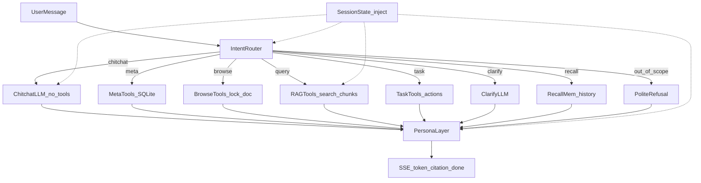
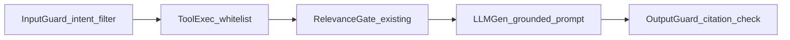

# 12 — Agent 化升级路线（Phase 4，未来规划）

> **实现状态**：`planned` — **不在 MVP（P1–P3）范围内实施**。本文档为 Phase 4 的架构规格与分阶段验收依据，供 MVP 完成后迭代使用。
>
> **背景**：R-017 / R-018 表明「单轨 RAG」（每条消息默认检索 → 门控 → 模板生成）在闲聊、元问题、浏览意图上存在结构性天花板；继续堆规则无法达到「像真人一样聊天且不乱编」的产品目标。

---

## 0 现状与目标

### 0.1 现状（MVP / P3 末）

当前问答入口为 [`api/routes/chat.py`](../../api/routes/chat.py) 内的 **单轨流水线**：

1. （可选）元问题直答 / 浏览锁文档 — 见 [`stream_kg/retrieval/meta_query.py`](../../stream_kg/retrieval/meta_query.py)
2. 否则：向量检索 → [`relevance_gate`](../../stream_kg/retrieval/relevance_gate.py) 门控 → [`rag_generator`](../../stream_kg/retrieval/rag_generator.py) 生成

已缓解但未根治的问题：

| 问题 | 暴雷编号 | 临时方案 |
|------|----------|----------|
| 概念题贴简历片段 | R-017 | 词面门控 + 证据保底收紧 |
| 「几篇文档」乱答 | R-018 | SQLite 元问题直答 |
| 浏览简历混入论文 chunk | R-018 | 锁定单文档 |
| 「我现在传文档 一会儿问你」被拒 | — | **未解决**（仍走 RAG 或冷拒答） |

### 0.2 目标（Phase 4）

将系统从 **「问一次答一次的检索器」** 升级为 **「个人知识 Agent」**：

- **像人一样对话**：寒暄、通知、感谢、能力说明有自然回应
- **事实 grounded**：涉及资料内容时必须基于检索/工具结果，带可回溯引用
- **不乱编**：闲聊不捏造文档内容；事实题无证据则拒答或澄清
- **可观测**：每条回答可追踪 intent、工具调用、检索来源
- **可降级**：LLM 路由失败时回退到现有规则通道（P4.0 规则层保留）

---

## 1 设计原则

| 原则 | 说明 |
|------|------|
| **RAG 是工具，不是入口** | 检索、读文档、查元数据均为 Agent 可调用的 tool，而非每条消息的默认路径 |
| **事实 / 闲聊双世界** | 闲聊仅可使用「会话状态」中的库摘要，不得编造 chunk 内容；事实题必须 grounded |
| **规则优先、LLM 兜底** | 高频意图（meta / browse / chitchat 短句）用规则毫秒级分流；不确定时再轻 LLM 路由 |
| **可观测可降级** | SSE `retrieval` 事件暴露 `intent` / `tools_called` / `retrieval_source`；路由失败回退规则 |
| **渐进替换，不推翻 P1–P3** | 向量检索、KG、Reranker、Graph Router 保留为底层能力，Agent 层编排调用 |
| **MVP 阶段不堆规则** | P4 之前避免在 `meta_query` / `relevance_gate` 上无限打补丁；结构性问题留 P4 解决 |

---

## 2 总体架构



### 2.1 控制流模式选型

| 模式 | Phase 4 采用 | 说明 |
|------|--------------|------|
| **Router / Dispatcher** | P4.0–P4.1 主模式 | 顶层意图分流，各通道独立优化 |
| **Tool-Calling / Function-Calling** | P4.2 主模式 | 将 meta / browse / query 统一为 tools，LLM 主动选择 |
| **ReAct** | P4.2 内层（可选） | 复杂 query 多步：search → read → summarize |
| Plan-and-Execute | 不采用 | 步骤刚性，对话场景收益低 |
| 多 Agent 辩论 | P4.4 可选 | 仅高风险事实校验 |
| Tree of Thoughts | 不采用 | 成本过高 |

---

## 3 意图分类

| Intent | 触发条件（规则层示例） | 响应策略 | 检索 | 引用 | 典型例子 |
|--------|------------------------|----------|------|------|----------|
| `chitchat` | 短句、无事实问号、ack/寒暄词 | 对话式 LLM + 会话状态，不调 tool | 否 | 否 | 你好 / 谢谢 / 我一会儿问你 / 我现在传文档 |
| `meta` | count/list 模式词 | 调 `count_documents` / `list_documents` | 否 | 否 | 一共有几篇文档 / 列一下文档 |
| `browse` | 看简历 / 看刚导入 / 最新链接 | 调 `read_document(doc_id)` 锁定单文档 | 否（读全文 chunk） | 可选 | 你看一下简历 |
| `query` | 默认；含实体/术语的事实问 | 调 `search_chunks(q)` + RAG 生成 | 是 | 是 | 程诺求职目标 / YOLO 小目标怎么处理 |
| `task` | 删/重处理/刷新等动作词 | 调 `delete_document` 等；需确认 | 否 | 否 | 帮我把简历删了 |
| `clarify` | 指代模糊 / 对比缺对象 | LLM 生成澄清问句 | 否 | 否 | 它怎么样 / 对比一下（库内仅一篇） |
| `recall` | 刚才 / 上一个 / 你刚说的 | 读会话历史 + 可选复用上轮 chunks | 否 | 可选 | 你刚才说的那个再讲讲 |
| `out_of_scope` | 概念题 + 库内无相关 + 门控拒 | 礼貌拒答 + 引导导入 | 否 | 否 | 知识图谱是什么（库内无） |

### 3.1 分流三层策略

1. **L1 硬规则**（毫秒）：扩展 [`meta_query.py`](../../stream_kg/retrieval/meta_query.py) — meta / browse / chitchat 模式
2. **L2 轻 LLM 路由**（P4.1）：规则不命中时，小模型输出 JSON：`{intent, confidence, needs_retrieval, clarify_question}`
3. **L3 默认 fallback**：`query` → RAG；门控失败 → `clarify` 或 `out_of_scope`，非冷模板

---

## 4 工具接口规范（P4.2 目标）

以下为 Agent Runtime 暴露给 LLM 的 tool 列表。实现时映射现有模块，**不改变底层存储契约**。

### 4.1 元数据类

| Tool | 签名 | 返回 | 映射模块 |
|------|------|------|----------|
| `count_documents` | `()` | `{total, ready, processing, failed, titles_sample[]}` | `SQLiteStore.list_documents` |
| `list_documents` | `(limit=10, status="ready")` | `{documents: [{doc_id, title, doc_type, status, page_count}]}` | `SQLiteStore.list_documents` |
| `get_document_status` | `(doc_id)` | `{doc_id, title, status, error_message, chunk_count}` | `SQLiteStore.get_document` + chunk count |

### 4.2 内容读取类

| Tool | 签名 | 返回 | 映射模块 |
|------|------|------|----------|
| `read_document` | `(doc_id, max_chunks=20)` | `{doc_id, title, chunks: [{chunk_id, content, page_num}]}` | `SQLiteStore.list_chunks_by_doc` |
| `search_chunks` | `(query, top_k=10, doc_id=null)` | `{chunks: [{chunk_id, doc_id, content, score, doc_title}]}` | `VectorSearchService.search` |
| `search_entities` | `(label, top_k=5)` | `{entities: [{entity_id, label, mention_count}]}` | `GraphStore` / Qdrant entities |

### 4.3 动作类（需用户确认）

| Tool | 签名 | 返回 | 映射模块 |
|------|------|------|----------|
| `delete_document` | `(doc_id, confirm=false)` | `{deleted, message}` | `documents` API + KG cascade |
| `reprocess_document` | `(doc_id)` | `{job_id, status}` | ingest reprocess |

### 4.4 错误码

| Code | 含义 | Agent 行为 |
|------|------|------------|
| `DOC_NOT_FOUND` | doc_id 不存在 | clarify 或 list_documents |
| `DOC_PROCESSING` | 文档未 ready | 告知处理中，建议稍后 |
| `NO_CHUNKS` | 文档无可用 chunk | 建议 reprocess |
| `LOW_RELEVANCE` | search 门控失败 | clarify 或 out_of_scope |
| `TOOL_DENIED` | 用户未 confirm 删除 | 再次询问确认 |

---

## 5 记忆分层

| 层级 | 内容 | MVP 现状 | P4 落地 |
|------|------|----------|---------|
| **工作记忆** | 当前轮 tool 结果、检索 chunks | 仅在单次请求 context | 显式 `WorkingMemory` 对象，上限 token |
| **短期记忆** | 最近 N 轮对话 | `chat_messages` 表 | 注入 `[最近对话]` 块（N=6–10） |
| **会话状态** | 库摘要、最近上传、当前任务 | 无 | 新表 `session_state` 或每次请求动态组装 |
| **长期记忆** | 用户偏好、高频主题 | 无 | 可选：向量化历史摘要写入 Qdrant `memories` |
| **程序性记忆** | 常用 query 模板、技能片段 | 无 | P4.4 可选，非 MVP |

### 5.1 会话状态块（每次 LLM 调用注入）

```
[会话状态]
- 资料库：共 3 份，已就绪 2 份（《程诺-简历》《YOLO 论文》），处理中 1 份
- 最近上传：《X》（2 分钟前，processing）
- 最近对话摘要：（可选，P4.3）
```

---

## 6 Persona 与 System Prompt 模板

### 6.1 角色定义（Persona Layer 统一出口）

> 你是用户的**私人知识助理**。你的职责是：
> 1. 像人一样自然对话（寒暄、感谢、进度通知）；
> 2. 当用户询问**已导入资料的内容**时，必须基于工具返回的上下文回答，并在关键结论后标注 `[n]`；
> 3. 当上下文不足以回答事实题时，**坦率说明**，不编造；
> 4. 当问题模糊时，**先澄清**，不要直接拒答；
> 5. 涉及资料库状态时，仅依据 `[会话状态]`，不猜测；
> 6. **禁止**把无关资料片段当作答案贴出。

### 6.2 双世界规则

| 世界 | 允许 | 禁止 |
|------|------|------|
| **闲聊** | 基于会话状态的进度/数量/能力说明 | 编造文档段落、假装读过未读文档 |
| **事实** | 仅使用 tool 返回的 chunk + 引用 | 无引用的关键事实、跨文档臆测 |

### 6.3 拒答语气库（替代冷模板）

- 库内无相关：`「资料库里还没有与「{topic}」相关的文档，导入后再问我会基于原文回答。」`
- 模糊指代：`「你是指《{candidate}》这份吗？还是别的文档？」`
- 处理中：`「《{title}》还在处理中，就绪后我再帮你看。」`

---

## 7 防幻觉边界



| 层级 | 机制 | 与现有代码关系 |
|------|------|----------------|
| **输入** | 意图分流；task 需 confirm；PII 脱敏（未来） | 新增 `intent_router` |
| **中间** | tool 白名单；browse 锁单 doc；search 走 `relevance_gate` | 保留 [`relevance_gate.py`](../../stream_kg/retrieval/relevance_gate.py) |
| **输出** | 事实题必须有 tool 证据；`[n]` 仅映射当前 chunks；禁止 evidence_fallback 无词面命中 | 收紧 [`rag_generator.py`](../../stream_kg/retrieval/rag_generator.py) |

---

## 8 分阶段路线图（Phase 4）

### P4.0 — 规则 Chitchat + 会话状态注入

**目标**：解决「我现在传文档 一会儿问你」类误判，零 LLM 路由成本。

| 项 | 内容 |
|----|------|
| 改动 | 扩展 `meta_query`：`detect_chitchat_intent`；`build_session_state_summary(sqlite)`；`chat.py` 新增 chitchat 通道 |
| 验收 | 寒暄/通知有自然回复；不涉及 RAG；检索条显示 `chitchat · 无检索` |
| 回归 | 「我现在传文档 一会儿问你」/「谢谢」/「你能干嘛」 |

### P4.1 — 轻 LLM 路由

**目标**：规则不命中时由小模型输出 intent JSON，减少边界误判。

| 项 | 内容 |
|----|------|
| 改动 | 新增 `stream_kg/agent/intent_router.py`；低 temperature 单次调用；confidence < 0.7 走 clarify |
| 验收 | 「它讲了啥」（有上条上传上下文）→ browse；「对比一下 A 和 B」（仅 A 在库）→ clarify |
| 回归 | 保留 P4.0 全部用例 + 10 条边界 query |

### P4.2 — Tool-Calling 重构

**目标**：统一 meta / browse / query 为 tools，LLM 主动选择；内层可 ReAct 多步。

| 项 | 内容 |
|----|------|
| 改动 | 新增 `stream_kg/agent/tools/`；`chat.py` 改为 tool loop（max 3 轮）；DeepSeek function calling |
| 验收 | 「几篇文档」调 count；「看简历」调 read_document；「程诺求职」调 search_chunks；同会话可混合 |
| 回归 | R-017 / R-018 全部场景 + tool 调用日志可观测 |

### P4.3 — 记忆与 Recall

**目标**：长对话「你刚才说的」可回顾；可选长期记忆摘要。

| 项 | 内容 |
|----|------|
| 改动 | recall 通道；注入最近 N 轮；可选 `memories` collection |
| 验收 | 「上一个问题你怎么答的」能引用历史；不重复全量 RAG |
| 回归 | 10 轮对话后 recall 准确率人工抽检 |

### P4.4 — 多 Agent / Critic（按需）

**目标**：复杂对比、高风险事实可选第二模型校验。

| 项 | 内容 |
|----|------|
| 改动 | 可选 `critic` 节点：生成后自检引用是否与 chunk 一致 |
| 验收 | 故意幻觉 query 拦截率提升（基准集） |
| 非目标 | 默认关闭；Demo 不启用 |

---

## 9 不做什么（非目标）

- 端侧 LLM 推理（仍用 DeepSeek API + 本地 Embedding/Reranker）
- Tree of Thoughts / 大规模多 Agent 自组织
- 长期自主学习（无用户确认的自动入库/改库）
- 主动推送 / 定时提醒（「您有 3 份文档未读」）
- 多用户 / 认证（保持单用户 MVP 假设，除非产品变更）
- 替代 P2 规则 C1 为 LLM 全量抽取（属 KG 专项，见 R-016，非 Agent 层职责）

---

## 10 与现有架构的兼容

| 现有能力 | Phase | Agent 层关系 |
|----------|-------|--------------|
| 向量检索 | P1 | 封装为 `search_chunks` tool |
| 增量 KG | P2 | 封装为 `search_entities`；Graph Router 仍 P3 |
| Reranker | P3 | `search_chunks` 内部可选 rerank 步骤 |
| `meta_query` 规则 | P4.0 前 | P4.2 后由 tools 取代，规则作 fallback |
| `relevance_gate` | 当前 | 保留为 `search_chunks` 出口校验 |
| SSE 协议 | P1 | 扩展 `retrieval` 事件字段，不破坏 token/citation/done |

### 10.1 将被 Tool-Calling 逐步取代的逻辑

- `detect_meta_intent` / `build_meta_answer` → `count_documents` / `list_documents`
- `resolve_browse_target` / `build_locked_chunks` → `read_document`
- `chat.py` 内硬编码三分支 → Agent tool loop

---

## 11 风险与开放问题

| 风险 | 缓解 |
|------|------|
| LLM 路由增加延迟与成本 | L1 规则覆盖 60%+；路由模型用 flash / 小模型 |
| Tool 调用失败 | 重试 1 次；fallback 到 P4.0 规则通道 |
| 记忆隐私 | 长期记忆默认关闭；仅会话级；删除文档时 purge 相关 memory |
| 模型切换（DeepSeek 版本） | tool schema 与 prompt 版本化；集成测试锁定 |
| 过度 Agent 化导致 Demo 不稳定 | Feature Flag `FEATURE_AGENT_ENABLED`；默认 false 直至 P4.2 验收 |

**开放问题**（实施前需决策）：

1. Chitchat 是否允许调用 `list_documents`（仅标题）还是纯文本？
2. Task intent（删除）是否在 P4.2 就接真实 API，还是仅引导用户去 UI？
3. Recall 是否存储 assistant 引用的 chunk_id 以便精确复现？

---

## 12 参考

### 12.1 项目内文档与暴雷

- [01-phases.md](01-phases.md) — P1–P3 交付边界
- [05-algorithms.md](05-algorithms.md) — C1/C3、Query Router、RAG
- [11-pipelines.md](11-pipelines.md) — 当前 QA 流水线
- [研发暴雷与修复日志.md](../研发暴雷与修复日志.md) — R-001、R-011、R-017、R-018

### 12.2 外部架构模式

- **ReAct**：Reason + Act 交替循环
- **Tool-Calling / Function-Calling**：结构化工具调用（OpenAI / Anthropic / DeepSeek 兼容）
- **Router / Dispatcher**：顶层意图分发（企业 Copilot 常见形态）
- **Reflexion / Critic**：生成后自检（P4.4 可选）

---

## 附录 A — Phase 4 Feature Flag（规划）

| Flag | 默认 | 说明 |
|------|------|------|
| `FEATURE_AGENT_ENABLED` | false | 总开关；false 时保持当前 chat 路径 |
| `FEATURE_AGENT_LLM_ROUTER` | false | P4.1 轻 LLM 路由 |
| `FEATURE_AGENT_TOOL_CALLING` | false | P4.2 tool loop |
| `FEATURE_AGENT_CRITIC` | false | P4.4 输出校验 |

详见未来更新 [07-config.md](07-config.md)（实施 P4.0 时补充）。
